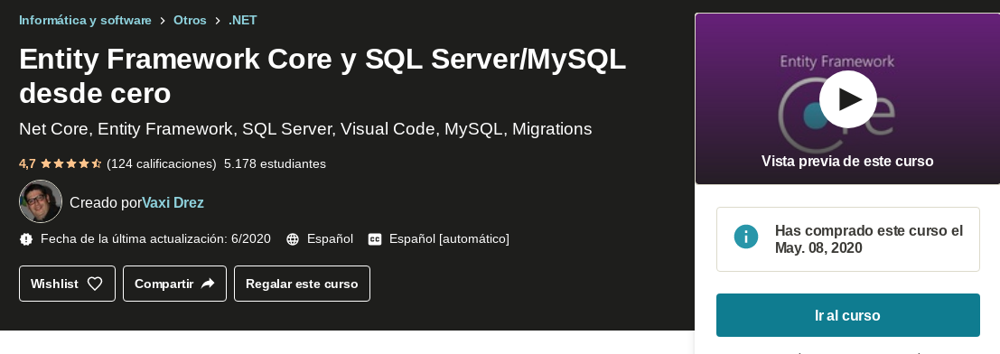

  

[📖 Udemy](https://www.udemy.com/course/net-core-entity-framework-core/)

# Entity Framewor Core

> Esta diseñada como un ORM, nos va a permitir mapear .net Core con la DBMS en este caso sql server

## Estructura de un proyecto con Net Core

- Solución
